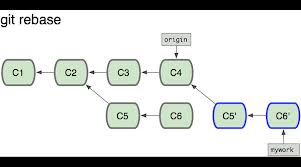
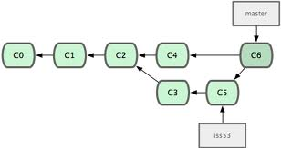

Git
===

Index, repository, working directory
------------------------------------

Notions importantes:

+--------+------------------------+
| HEAD   | Tête du dépôt courant. |
+--------+------------------------+
| Index  | Ce qui sera commité.   |
+--------+------------------------+
| Master | Default de mercurial.  |
+--------+------------------------+

.. figure:: _static/gitIndex.png
   :align: center

Le remote par défaut est +origin+ mais on peut avoir autant de remote qu'on souhaite pour un même repo. Chaque remote à son master et ses branches.

Commande de base
----------------

+-------------------------------------------+--------------------------------------------------------------------------------------+
| git add                                   |  fichier à modifier pour les fichiers à ne pas prendre en compte lors de git status. |
+-------------------------------------------+--------------------------------------------------------------------------------------+
| git clone <REMOTE>                        | crée le premier remote (origin).                                                     |
+-------------------------------------------+--------------------------------------------------------------------------------------+
| git checkout branche_remote -b ma_branche | rapatrie branche_remote, créé la branche ma_branch à partir de branch_remote.        |
+-------------------------------------------+--------------------------------------------------------------------------------------+
| git checkout master                       | rapatrie master et me laisse sur master.                                             |
+-------------------------------------------+--------------------------------------------------------------------------------------+
| git fetch                                 | hg pull.                                                                             |
+-------------------------------------------+--------------------------------------------------------------------------------------+
| git remote -v                             | liste les remotes.                                                                   |
+-------------------------------------------+--------------------------------------------------------------------------------------+
| git reset HEAD <file>                     | enlève *file* de l'index.                                                            |
+-------------------------------------------+--------------------------------------------------------------------------------------+

Rebase/Merge
------------

.. code-block:: sh

    git checkout ma_branche
    git rebase master

va mettre les commits de ma_branche à la suite de master.

.. code-block:: sh

    git checkout master
    git merge ma_branch

déplace le tag master sur ma_branch.

Diff
----

+-------------------+----------------------------------+
| git diff          |  différence entre index et repo. |
+-------------------+----------------------------------+
| git diff HEAD     | différence entre HEAD et repo.   |
+-------------------+----------------------------------+
| git diff --staged | différence entre HEAD et index.  |
+-------------------+----------------------------------+
| HEAD^1            | parent de HEAD.                  |
+-------------------+----------------------------------+

Remote, branches
----------------

+------------------------------------------+-----------------------------------------------+
| git branch -ra                           | liste les branches local et remote.           |
+------------------------------------------+-----------------------------------------------+
| git fetch toto                           | Pour rapatrier un remote toto.                |
+------------------------------------------+-----------------------------------------------+
| git remote -v                            | Pour lister tous les remote.                  |
+------------------------------------------+-----------------------------------------------+
| git push mon_remote ma_branche           | Lorsque l'on push ses modifications.          |
+------------------------------------------+-----------------------------------------------+
| git remote show mon_remote               | Pour avoir plus d'informations sur un remote. |
+------------------------------------------+-----------------------------------------------+
| git remote rename ancien_nom nouveau_nom | Pour renommer des remotes.                    |
+------------------------------------------+-----------------------------------------------+
| git remote rm mon_remote                 | Pour supprimer des remotes.                   |
+------------------------------------------+-----------------------------------------------+

Remisage
--------

git stash permet de mettre des modifications en attentes pour faire des modifications.

.. code-block:: sh

    git stash
    git stash list

Pour réappliquer les modification stocké dans un stash ancien :

.. code-block:: sh

    git stash apply

tig
---

.. code-block:: sh

    sudo apt-get install tig

'd' diff entre le commit et le head de master.

Merge avec vimdiff
------------------

Configurer git pour faire un merge avec vimdiff.

.. code-block:: sh

    git config merge.tool vimdiff
    git config merge.conflictstyle diff3
    git config mergetools.prompt false

.. note:: Encore à tester.
